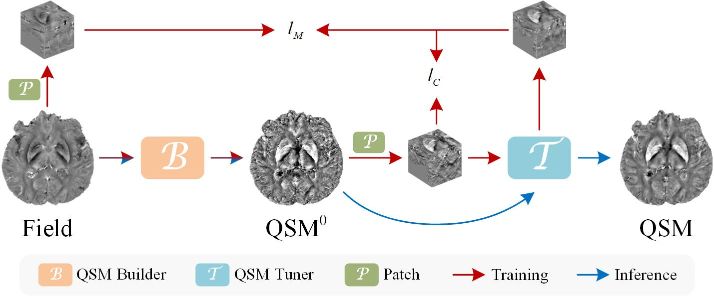

# msQSM: Morphology-based Self-supervised Deep Learning for Quantitative Susceptibility Mapping

## Overview
We provide the PyTorch implementation of our NeuroImage submission ["msQSM"](https://doi.org/10.1016/j.neuroimage.2023.120181).

## Files description
msQSM contains the following folders:

--data: provides samples of in-house data, as well as a 9.4T Mouse data and hemorrhage data.

--src: includes source codes.

--checkpoints: includes a pre-trained model.

## Usage

### Install requirements

pip install -r requirements.txt

### Test

You can run infer.py directly to reconstruct QSM on the provided data. The results will be saved under the data folder.

For testing your own data, you can refer to the script and re-write it.

### Train

If you want to train msQSM by yourself, refer to create_data.py and create your own training data.
Run train.py to train msQSM on your dataset.
